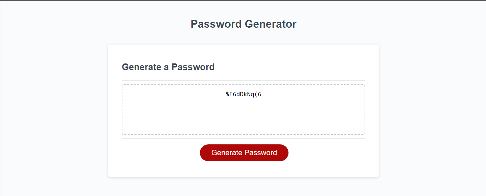

# Password Generator
This password generator enables the end user to generate random passwords based on criteria that they're selected. This app will run in the browser and will feature dynamically updated HTML and CSS powered by JavaScript code.

For source code, visit my Github repo @ [Github] (https://github.com/mxrtinee/Password-Generator)

## User Story

```
AS AN employee with access to sensitive data
I WANT to randomly generate a password that meets certain criteria
SO THAT I can create a strong password that provides greater security
```

## Acceptance Criteria

```
GIVEN I need a new, secure password
WHEN I click the button to generate a password
THEN I am presented with a series of prompts for password criteria
WHEN prompted for password criteria
THEN I select which criteria to include in the password
WHEN prompted for the length of the password
THEN I choose a length of at least 8 characters and no more than 128 characters
WHEN asked for character types to include in the password
THEN I confirm whether or not to include lowercase, uppercase, numeric, and/or special characters
WHEN I answer each prompt
THEN my input should be validated and at least one character type should be selected
WHEN all prompts are answered
THEN a password is generated that matches the selected criteria
WHEN the password is generated
THEN the password is either displayed in an alert or written to the page
```

## Screenshot

The following image shows the web application's appearance and functionality:



Please see the live webpage link for you to checkout

## How to Use

1. Once you have opened the Password Generator Application in your web browser.
2. You will be presented with a form to generate a password.
3. Click "Generate Password"
4. You will be promted to enter the desired password length (between 8 and 128 characters) in the input field.
5. Select the types of characters to include in the password:
   - Click the "Would you like to include Lowercase Letters?" "Okay" button to include lowercase letters and click "Cancel" if this isn't desired. (e.g., abcdefgh).
   - Click the "Would you like to include Uppercase Letters?" "Okay" button to include uppercase letters and click "Cancel" if this isn't desired. (e.g., ABCDEFGH).
   - Click the "Would you like to include Numbers?" "Okay" button to include numeric characters and click "Cancel" if this isn't desired. (e.g., 0123456789).
   - Click the "Would you like to include Special Characters?" "Okay" button to include special characters and click "Cancel" if this isn't desired. (e.g., !@#$%^&*()-_=+".)
6. Once you've made your selections the randomly generated password will be displayed in the textarea above the button.
8. You can copy the generated password and use it as needed for secure login or account creation.